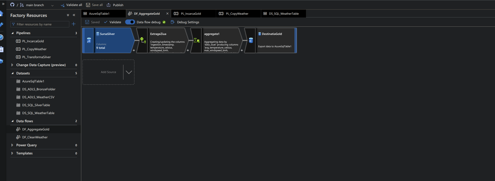

# 🌦️ End-to-End Weather Data Engineering Pipeline (Medallion Architecture)

A comprehensive Data Engineering project demonstrating a full ETL pipeline. The project starts with local data extraction using Python & Docker, and evolves into a scalable Cloud architecture using **Azure Data Factory**, **Azure SQL**, and **PySpark (Data Flows)** following the **Medallion Architecture** (Bronze, Silver, Gold).

## 📌 Architecture Overview

1. **Extract:** A Python script (`weather_ETL.py`) pulls real-time weather data from an API.
2. **Local Infrastructure:** Uses Docker and Docker Compose to containerize the app and optionally store raw data in a local PostgreSQL database.
3. **Cloud Ingestion:** Data is pushed to **Azure Data Lake Storage Gen2**.
4. **Cloud Orchestration:** **Azure Data Factory (ADF)** automates the pipeline, using Metadata and ForEach iterators to dynamically copy new files.
5. **Security:** All database credentials are encrypted and accessed via **Azure Key Vault** using Managed Identities.
6. **Data Transformation (Medallion):**
   * 🥉 **Bronze Layer:** Raw data loaded directly from the Data Lake into Azure SQL.
   * 🥈 **Silver Layer:** ADF Mapping Data Flows (PySpark) cleans the data (filters anomalies) and creates new calculated columns (e.g., Celsius to Fahrenheit).
   * 🥇 **Gold Layer:** Data is grouped and aggregated (Average Temperature, Max Wind Speed per day) to be served to BI tools like Power BI.

## 🚀 Technical Stack
* **Language:** Python 3.x (`requests`, `pandas`, `sqlalchemy`)
* **Local Containerization:** Docker, Docker-Compose
* **Cloud Platform:** Microsoft Azure
* **Cloud Services:** Azure Data Factory, Azure SQL Database, Azure Data Lake Gen2, Azure Key Vault

## 📸 Project Showcase

### 1. Pipeline Orchestration & Automation
*The main Azure Data Factory pipeline. It uses a `Get Metadata` activity to scan the Data Lake for new files, and a `ForEach` loop to iterate and copy data dynamically into the Bronze layer.*

### 2. Enterprise-Grade Security
*Implementation of Azure Key Vault via Linked Services. Passwords are never hardcoded; ADF retrieves the SQL credentials dynamically during runtime.*

### 3. Data Transformation (PySpark Data Flows)
*The transformation logic from Silver to Gold. It uses a `Derived Column` to extract the Date, and an `Aggregate` function to group daily metrics (average temperatures and max wind speed).*

### 4. The Final Result (Gold Layer)
*The fully cleaned and aggregated data residing in the Azure SQL `weather_gold` table, ready to be consumed by Business Intelligence tools.*

## 🛠️ Repository Structure
* `src/`: Contains the Python ETL extraction script.
* `sql_queries/`: SQL scripts for creating the Medallion tables (Bronze, Silver, Gold).
* `docker-compose.yml` & `Dockerfile`: Local testing and execution environments.
* `/ADF`: Contains the exported JSON definitions of the Azure Data Factory resources.