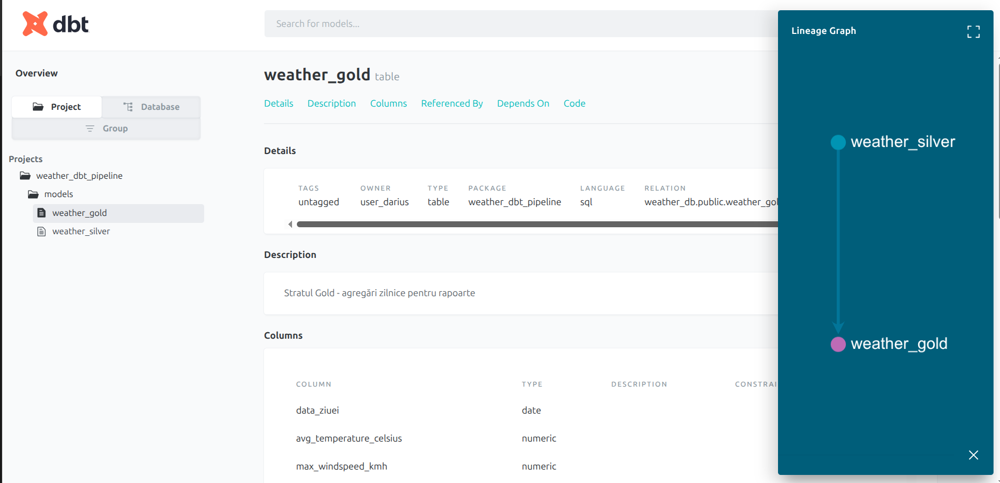
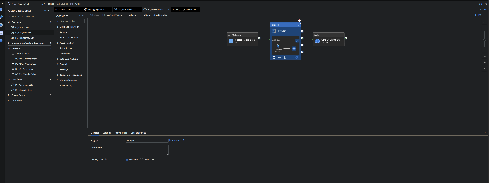
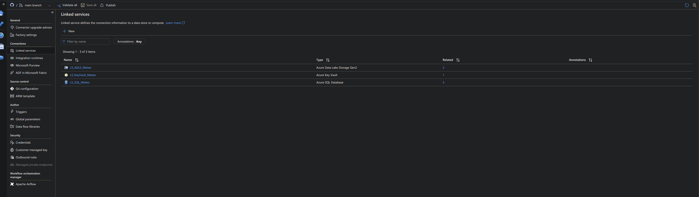
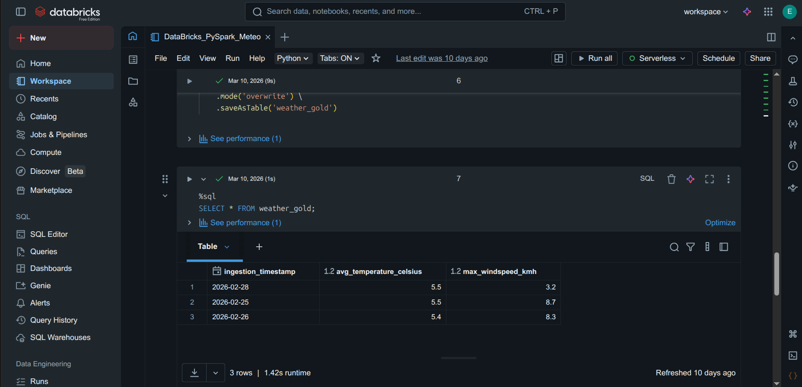
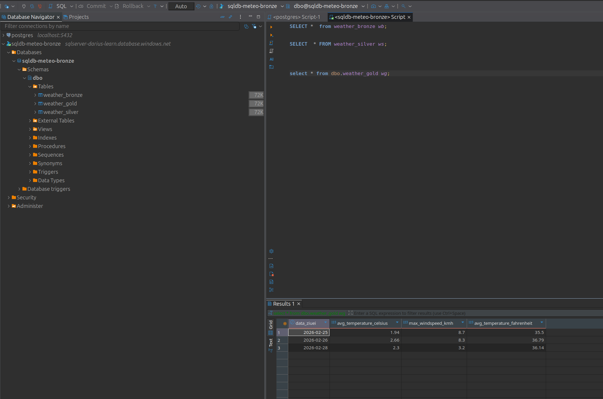

# 🌦️ End-to-End Weather Data Engineering Pipeline


A comprehensive Data Engineering project demonstrating a full ETL/ELT pipeline. This project showcases a **hybrid architecture**, starting with a containerized local environment for testing, and evolving into a highly scalable Cloud architecture using **Azure Data Factory**, **Databricks**, and **dbt (Data Build Tool)** following the **Medallion Architecture** (Bronze, Silver, Gold).

## 📌 Architecture Overview

### 1. Local Development (CI/CD Ready)
* **Extract:** A Python script (`weather_ETL.py`) pulls real-time weather data from the Open-Meteo API.
* **Infrastructure:** Fully containerized using `docker-compose`, spinning up a PostgreSQL database, the Python extraction service, and a dbt transformation container.
* **Transform & Test:** **dbt Core** is used to build the Medallion architecture locally, executing SQL models to clean data (Silver) and aggregate daily metrics (Gold). Automated data quality tests are strictly enforced.

### 2. Cloud Production (Microsoft Azure)
* **Ingestion:** Data is pushed to **Azure Data Lake Storage Gen2**.
* **Orchestration:** **Azure Data Factory (ADF)** automates the pipeline, using Metadata and ForEach iterators to dynamically copy new files.
* **Transformation (PySpark):** **Databricks** and ADF Mapping Data Flows are utilized to process large-scale data in the cloud, generating the final reporting tables.
* **Security:** All database credentials are encrypted and accessed via **Azure Key Vault** using Managed Identities.

## 🚀 Technical Stack
* **Languages:** Python 3.x, SQL, PySpark
* **Data Transformation:** dbt (Data Build Tool), Pandas
* **Containerization:** Docker, Docker-Compose
* **Cloud Platform:** Microsoft Azure (ADF, Azure SQL, ADLS Gen2, Key Vault)
* **Big Data Compute:** Databricks

## 📸 Project Showcase

### 1. Modern Data Stack: dbt Lineage & Documentation
*Automated documentation and data lineage generated by dbt, illustrating the flow from raw data to the aggregated Gold layer.*

*(Note: Adaugă poza ta cu dbt_lineage.png în folderul images)*

### 2. Pipeline Orchestration & Automation
*The main Azure Data Factory pipeline dynamically copying data into the Bronze layer.*


### 3. Enterprise-Grade Security
*Implementation of Azure Key Vault via Linked Services. Passwords are never hardcoded.*


### 4. Big Data Transformation (Databricks / PySpark)
*The transformation logic written in PySpark to aggregate daily metrics.*

*(Note: Adaugă poza ta cu Databricks în folderul images)*

### 5. The Final Result (Gold Layer)
*The fully cleaned and aggregated data residing in the Azure SQL `weather_gold` table, ready for Power BI.*


## 🛠️ Repository Structure
* `src/`: Python ETL extraction script and Databricks notebooks.
* `weather_dbt_pipeline/`: The complete dbt project (models, tests, configuration).
* `sql_queries/`: Raw SQL scripts for the Medallion tables.
* `docker-compose.yml` & `Dockerfile`: Infrastructure as Code for the local environment.
* `ADF/`: Exported JSON definitions of the Azure Data Factory resources.

## ⚙️ How to Run Locally

1. **Clone the repository:**
   ```bash
   git clone https://github.com/Bahna-Darius/data-engineering-weather.git
   cd data-engineering-weather