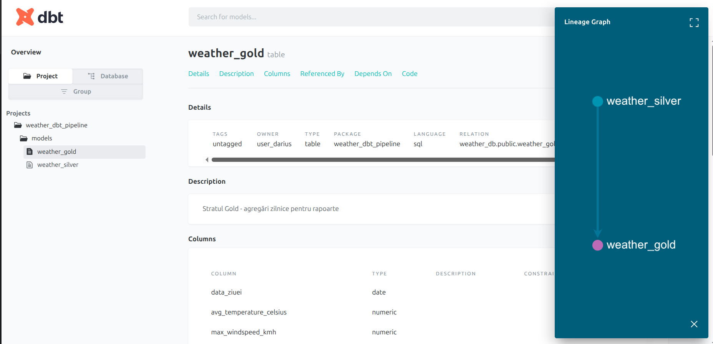
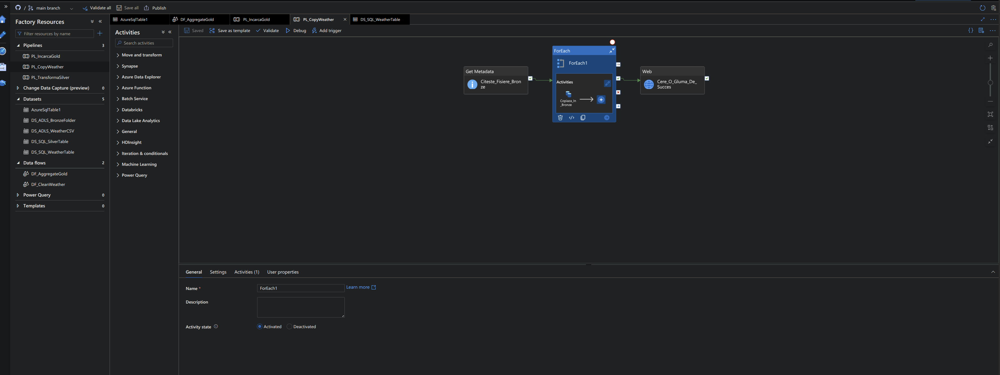
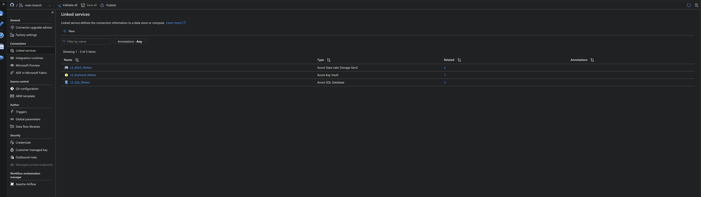
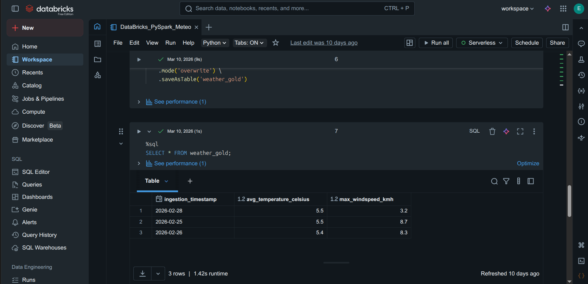
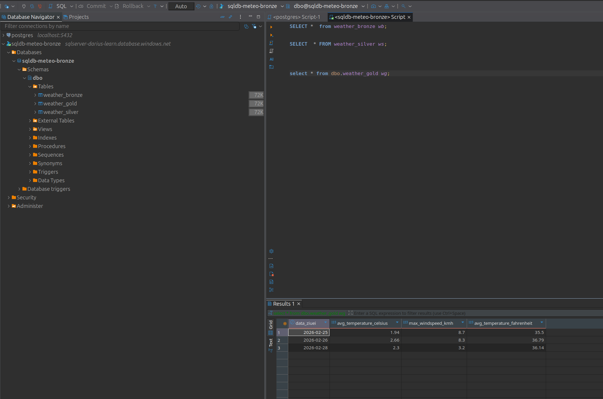

# End-to-End Weather Data Engineering Pipeline


A Data Engineering project demonstrating a full ETL/ELT pipeline with a **hybrid architecture** — a containerized local environment for development, and a scalable cloud architecture on **Microsoft Azure** following the **Medallion Architecture** (Bronze → Silver → Gold).

---

## Architecture Overview

### Local Development
- **Extract:** Python script pulls real-time weather data from the Open-Meteo API every hour via a Linux cron job.
- **Infrastructure:** Fully containerized using `docker-compose` (PostgreSQL + Python ETL + dbt).
- **Transform & Test:** dbt Core builds the Silver and Gold layers with automated data quality tests.

### Cloud Production (Microsoft Azure)
- **Ingestion:** CSV files are pushed to Azure Data Lake Storage Gen2 (Bronze layer).
- **Orchestration:** Azure Data Factory automates the pipeline using GetMetadata + ForEach for dynamic file processing.
- **Transformation:** Databricks (PySpark) and ADF Mapping Data Flows generate Silver and Gold tables.
- **Security:** All credentials are stored in Azure Key Vault, accessed via Managed Identity — no secrets in code.

---

## Technical Stack

| Layer | Technology |
|---|---|
| Language | Python 3.x, SQL, PySpark |
| Transformation | dbt Core, Pandas |
| Containerization | Docker, Docker Compose |
| Cloud | Azure Data Factory, Azure SQL, ADLS Gen2, Key Vault |
| Big Data | Databricks |
| Scheduling | Linux Cron |

---

## Repository Structure

```
weather_project/
├── ADF/                        # Azure Data Factory JSON exports
│   ├── pipeline/               # PL_CopyWeather, PL_TransformaSilver, PL_IncarcaGold
│   ├── dataflow/               # DF_CleanWeather, DF_AggregateGold
│   ├── dataset/
│   └── linkedService/
│
├── src/                        # Python source code
│   ├── weather_ETL.py          # Main ETL script (Extract → Transform → Load)
│   ├── config.py               # API and database configuration
│   └── notebooks/
│       └── databricks_pyspark_meteo.ipynb
│
├── weather_dbt_pipeline/       # dbt project (Silver & Gold models)
│   └── models/
│       ├── weather_silver.sql
│       ├── weather_gold.sql
│       └── schema.yml          # Data quality tests
│
├── sql_queries/                # DDL scripts for Azure SQL tables
│   ├── create_bronze.sql
│   ├── create_silver.sql
│   └── create_gold.sql
│
├── scripts/
│   └── take_data.sh            # Cron job wrapper script
│
├── docs/
│   └── images/                 # Screenshots for documentation
│
├── data/
│   └── weather_data.csv        # Sample historical data
│
├── docker-compose.yml
├── Dockerfile
├── Dockerfile.dbt
├── requirements.txt
└── .env.example                # Environment variable template
```

---

## How to Run Locally

### Prerequisites
- Docker & Docker Compose
- Python 3.9+

### Steps

1. **Clone the repository:**
   ```bash
   git clone https://github.com/Bahna-Darius/data-engineering-weather.git
   cd data-engineering-weather
   ```

2. **Configure environment variables:**
   ```bash
   cp .env.example .env
   # Edit .env with your credentials
   ```

3. **Start the infrastructure:**
   ```bash
   docker-compose up -d db_weather
   ```

4. **Run the ETL manually:**
   ```bash
   python src/weather_ETL.py
   ```

5. **Run dbt transformations:**
   ```bash
   cd weather_dbt_pipeline
   dbt run
   dbt test
   ```

### Automated Hourly Collection (Cron)
```bash
chmod +x scripts/take_data.sh
crontab -e
# Add: 0 * * * * /path/to/scripts/take_data.sh
```

---

## Project Showcase

### 1. dbt Lineage Graph


### 2. ADF Pipeline — Bronze Ingestion


### 3. Azure Key Vault — Enterprise Security


### 4. Databricks — PySpark Transformation


### 5. Gold Layer in DBeaver

